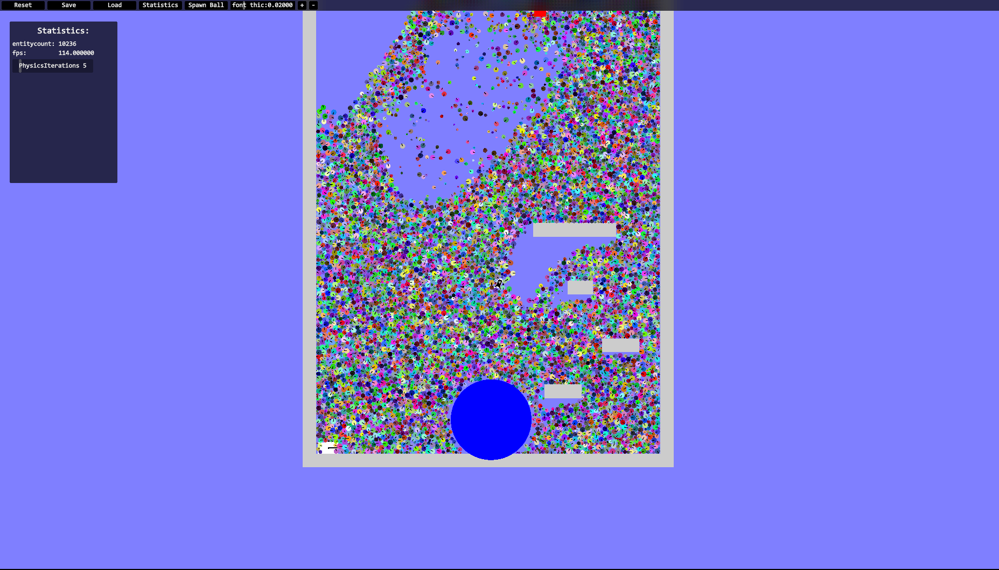
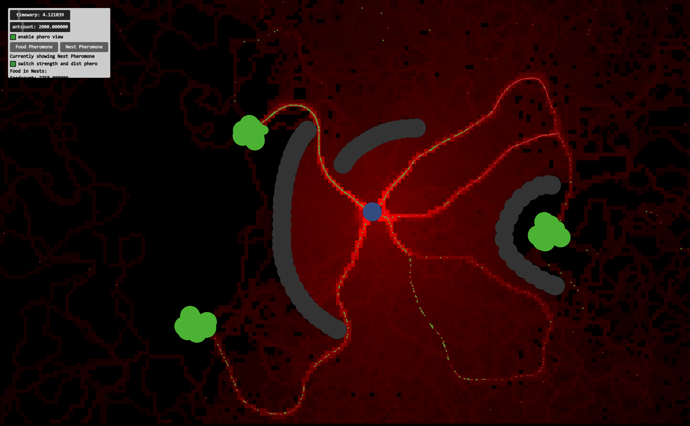

# This is a general purpose 2d realtime game/application engine
# This is configured to be used for Visual Studio 2019 only. 

It has the following features:
* simple job system
* multithreaded 2d renderer
* multithreaded collision system 
* physics system
* retained mode gui library
* entity component system based on sparse sets and paged arrays

here is an example of the collision and physics system in a 2d world where balls fall down to a drain (blue circle) and are spewd out at the top (red square):
Notable is that this sim has very stable stacking of the balls that is achieved my accumulated impulse resolution. Also the speed of the simulation is very good at over 110 fps with 10 000 colliding balls due to good cache and core utalization.

and an example where i made an ant simulation where the ants ai would work purely based on two pheromone grids to navigate, where the grid is updated in parallel via the job system:

The seen GUI in the images above is custom made and integrated into the engine.

dependencies:
the dependencies are all available in vcpkg, there is no integration of the dependencies outside of vcpkg.
the dependencies are all linked staticly for windows on x64
the configuration triple is: package:x64-windows-static
  * glfw3
  * glew
  * robin_hood-hashing
  * boost
  * yaml-cpp
